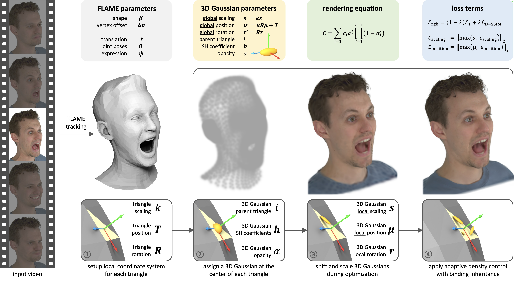
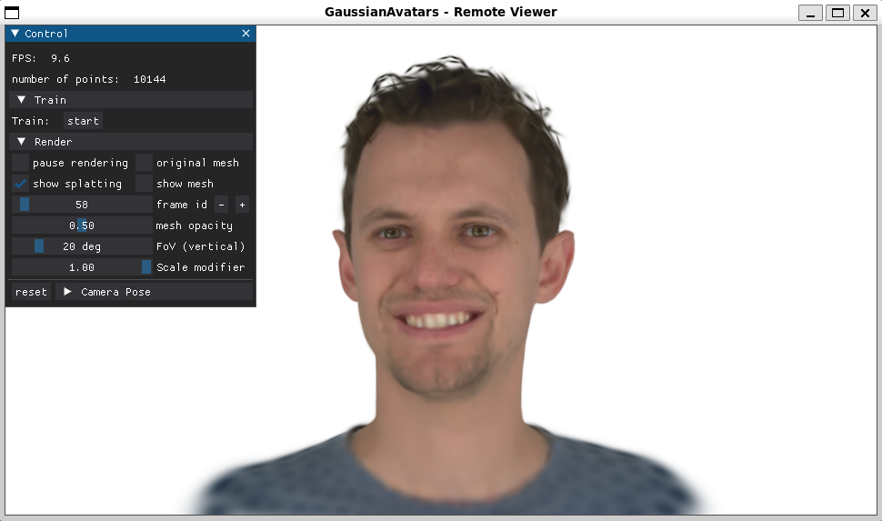
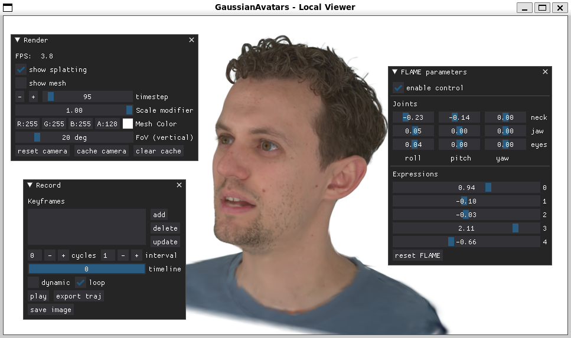

# GaussianAvatars: Photorealistic Head Avatars with Rigged 3D Gaussians



[project](https://shenhanqian.github.io/gaussian-avatars) / [arxiv](http://arxiv.org/abs/2312.02069) / [video](https://www.youtube.com/watch?v=lVEY78RwU_I) / [bibtex](https://shenhanqian.github.io/raw.html?filePath=/assets/2023-12-04-gaussian-avatars/bibtex.bib)

## Licenses

Toyota Motor Europe NV/SA and its affiliated companies retain all intellectual 
property and proprietary rights in and to this software and related documentation. 
Any commercial use, reproduction, disclosure or distribution 
of this software and related documentation without an express license agreement 
from Toyota Motor Europe NV/SA is strictly prohibited.

This project uses [Gaussian Splatting](https://github.com/graphdeco-inria/gaussian-splatting), which carries its [original license](./LICENSE_GS.md).
The GUI is inspired by [INSTA](https://github.com/Zielon/INSTA). 
The mesh rendering operations are adapted from [NVDiffRec](https://github.com/NVlabs/nvdiffrec) and [NVDiffRast](https://github.com/NVlabs/nvdiffrast). 

This work is made available under [Creative Commons Attribution-NonCommercial-ShareAlike 4.0 International](./LICENSE.md).

## Setup

### Hardware Requirements

- CUDA-ready GPU with Compute Capability 7.0+
- 12 GB VRAM (to train to paper evaluation quality)

### Software Requirements

- Conda (recommended for easy setup)
- C++ Compiler for PyTorch extensions (we used Visual Studio 2019 for Windows, GCC for Linux)
- CUDA SDK 11 for PyTorch extensions, install *after* Visual Studio or GCC (we used 11.7, **known issues with 11.6**)
- C++ Compiler and CUDA SDK must be compatible
- FFMPEG to create result videos

### Additional python packages

- RoMa (for rotation representations by default)
- PyTorch3D (for mesh loading and optionally rotation representations)
- DearPyGUI (for viewer interface)
- NVDiffRast (for mesh rendering in viewer)

### Environment

Our default installation method is based on Conda package and environment management:

```shell
SET DISTUTILS_USE_SDK=1 # Windows only

git clone https://github.com/ShenhanQian/GaussianAvatars.git --recursive
cd GaussianAvatars

conda create --name gaussian-avatars -y python=3.10
conda activate gaussian-avatars

conda install ninja
conda install -c "nvidia/label/cuda-11.7.1" cuda-toolkit
ln -s "$CONDA_PREFIX/lib" "$CONDA_PREFIX/lib64"  # to avoid error "/usr/bin/ld: cannot find -lcudart"
pip install torch==2.0.1 torchvision==0.15.2  # match CUDA 11.7 by default

pip install -r requirements.txt  # can take a while for compiling pytorch3d and nvdiffrast
```

### Data

#### Preprocessed NeRSemble dataset

We use 9 subjects from NeRSemble dataset in our paper. We provide the pre-processed data with this OneDrive [link](https://tumde-my.sharepoint.com/:f:/g/personal/shenhan_qian_tum_de/EtgO7DSNVzNKuYMRQeL4PE0BqMsTwdpQ09puewDLQBz87A).
To get access to the data, please

1. Request for the raw dataset [here](https://forms.gle/rYRoGNh2ed51TDWX9).
2. Request for the 9 pre-processed subjects [here](https://forms.gle/dPEJx5DNvmhTm2Ry5).

Please download the pre-processed data and decompress into `data/`.

#### FLAME

Our code and the pre-processed data relies on FLAME 2023. Downloaded assets from https://flame.is.tue.mpg.de/download.php and store them in below paths:

- `flame_model/assets/flame/flame2023.pkl`  # FLAME 2023 (versions w/ jaw rotation)
- `flame_model/assets/flame/FLAME_masks.pkl`  # FLAME Vertex Masks

> It is possible to run our method with FLAME 2020 by download to `flame_model/assets/flamegeneric_model.pkl`. The `FLAME_MODEL_PATH` in `flame_model/flame.py` needs to be updated accordingly. And the FLAME tracking results should also be based on FLAME 2020 in this case.

## Running
### Training

To run the optimizer, simply use

```shell
SUBJECT=306 && python train.py \
-s data/UNION10_${SUBJECT}_EMO1234EXP234589_v16_DS2-0.5x_lmkSTAR_teethV3_SMOOTH_offsetS_whiteBg_maskBelowLine \
-m output/UNION10EMOEXP_${SUBJECT}_eval_600k \
--port 60000 --eval --white_background --bind_to_mesh
```

<details>
<summary><span style="font-weight: bold;">Command Line Arguments for train.py</span></summary>

  #### --source_path / -s
  Path to the source directory containing a COLMAP or Synthetic NeRF data set.
  #### --model_path / -m 
  Path where the trained model should be stored (```output/<random>``` by default).
  #### --eval
  Add this flag to use a training/val/test split for evaluation.
  #### --bind_to_mesh
  Add this flag to bind 3D Gaussians to a driving mesh, e.g., FLAME.
  #### --resolution / -r
  Specifies resolution of the loaded images before training. If provided ```1, 2, 4``` or ```8```, uses original, 1/2, 1/4 or 1/8 resolution, respectively. For all other values, rescales the width to the given number while maintaining image aspect. **If not set and input image width exceeds 1.6K pixels, inputs are automatically rescaled to this target.**
  #### --data_device
  Specifies where to put the source image data, ```cuda``` by default, recommended to use ```cpu``` if training on large/high-resolution dataset, will reduce VRAM consumption, but slightly slow down training. Thanks to [HrsPythonix](https://github.com/HrsPythonix).
  #### --white_background / -w
  Add this flag to use white background instead of black (default), e.g., for evaluation of NeRF Synthetic dataset.
  #### --sh_degree
  Order of spherical harmonics to be used (no larger than 3). ```3``` by default.
  #### --convert_SHs_python
  Flag to make pipeline compute forward and backward of SHs with PyTorch instead of ours.
  #### --convert_cov3D_python
  Flag to make pipeline compute forward and backward of the 3D covariance with PyTorch instead of ours.
  #### --debug
  Enables debug mode if you experience erros. If the rasterizer fails, a ```dump``` file is created that you may forward to us in an issue so we can take a look.
  #### --debug_from
  Debugging is **slow**. You may specify an iteration (starting from 0) after which the above debugging becomes active.
  #### --iterations
  Number of total iterations to train for, ```30_000``` by default.
  #### --ip
  IP to start GUI server on, ```127.0.0.1``` by default.
  #### --port 
  Port to use for GUI server, ```60000``` by default.
  #### --test_iterations
  Space-separated iterations at which the training script computes L1 and PSNR over test set, ```7000 30000``` by default.
  #### --save_iterations
  Space-separated iterations at which the training script saves the Gaussian model, ```7000 30000 <iterations>``` by default.
  #### --checkpoint_iterations
  Space-separated iterations at which to store a checkpoint for continuing later, saved in the model directory.
  #### --start_checkpoint
  Path to a saved checkpoint to continue training from.
  #### --quiet 
  Flag to omit any text written to standard out pipe. 
  #### --feature_lr
  Spherical harmonics features learning rate, ```0.0025``` by default.
  #### --opacity_lr
  Opacity learning rate, ```0.05``` by default.
  #### --scaling_lr
  Scaling learning rate, ```0.005``` by default.
  #### --rotation_lr
  Rotation learning rate, ```0.001``` by default.
  #### --position_lr_max_steps
  Number of steps (from 0) where position learning rate goes from ```initial``` to ```final```. ```30_000``` by default.
  #### --position_lr_init
  Initial 3D position learning rate, ```0.00016``` by default.
  #### --position_lr_final
  Final 3D position learning rate, ```0.0000016``` by default.
  #### --position_lr_delay_mult
  Position learning rate multiplier (cf. Plenoxels), ```0.01``` by default. 
  #### --densify_from_iter
  Iteration where densification starts, ```500``` by default. 
  #### --densify_until_iter
  Iteration where densification stops, ```15_000``` by default.
  #### --densify_grad_threshold
  Limit that decides if points should be densified based on 2D position gradient, ```0.0002``` by default.
  #### --densification_interal
  How frequently to densify, ```100``` (every 100 iterations) by default.
  #### --opacity_reset_interval
  How frequently to reset opacity, ```3_000``` by default. 
  #### --lambda_dssim
  Influence of SSIM on total loss from 0 to 1, ```0.2``` by default. 
  #### --percent_dense
  Percentage of scene extent (0--1) a point must exceed to be forcibly densified, ```0.01``` by default.

</details>

By default, the trained models use all available images in the dataset. To train them while withholding a validation set and a test set for evaluation, use the ```--eval``` flag. Evaluation on the validation and test set will be conducted every `--interval` iterations. You can check the metrics in the terminal or within tensorboard.

### Rendering

```shell
python render.py -m <path to trained model> # Generate renderings
```

Only render the validation set:

```shell
SUBJECT=306 && python render.py \
-m output/UNION10EMOEXP_${SUBJECT}_eval_600k \
--skip_train --skip_test
```

Only render the test set (and only render in the a front view):
```shell
SUBJECT=306 && python render.py \
-m output/UNION10EMOEXP_${SUBJECT}_eval_600k \
--skip_train --skip_val
--select_camera_id 8  # front view
```

Reenactment (and only render in the a front view):
```shell
TGT_SUBJECT=218 && SUBJECT=306 && python render.py \
-t data/UNION10_${TGT_SUBJECT}_EMO1234EXP234589_v16_DS2-0.5x_lmkSTAR_teethV3_SMOOTH_offsetS_whiteBg_maskBelowLine \
-m output/UNION10EMOEXP_${SUBJECT}_eval_600k \
--select_camera_id 8  # front view
```


<details>
<summary><span style="font-weight: bold;">Command Line Arguments for render.py</span></summary>

  #### --model_path / -m 
  Path to the trained model directory you want to create renderings for.
  #### --skip_train
  Flag to skip rendering the training set.
  #### --skip_val
  Flag to skip rendering the test set.
  #### --skip_test
  Flag to skip rendering the validation set.  
  #### --quiet 
  Flag to omit any text written to standard out pipe. 
  #### --select_camera_id
  Only render from a specific camera id.
  #### --target_path / -t
  Path to the target directory containing a motion sequence for reenactment.

  **The below parameters will be read automatically from the model path, based on what was used for training. However, you may override them by providing them explicitly on the command line.** 

  #### --source_path / -s
  Path to the source directory containing a COLMAP or Synthetic NeRF data set.
  #### --images / -i
  Alternative subdirectory for COLMAP images (```images``` by default).
  #### --eval
  Add this flag to use a MipNeRF360-style training/test split for evaluation.
  #### --resolution / -r
  Changes the resolution of the loaded images before training. If provided ```1, 2, 4``` or ```8```, uses original, 1/2, 1/4 or 1/8 resolution, respectively. For all other values, rescales the width to the given number while maintaining image aspect. ```1``` by default.
  #### --white_background / -w
  Add this flag to use white background instead of black (default), e.g., for evaluation of NeRF Synthetic dataset.
  #### --convert_SHs_python
  Flag to make pipeline render with computed SHs from PyTorch instead of ours.
  #### --convert_cov3D_python
  Flag to make pipeline render with computed 3D covariance from PyTorch instead of ours.

</details>

### Computing metrics

```shell
python metrics.py -m <path to trained model> # Compute error metrics on renderings
```

<details>
<summary><span style="font-weight: bold;">Command Line Arguments for metrics.py</span></summary>

  #### --model_paths / -m 
  Space-separated list of model paths for which metrics should be computed.
</details>
<br>


## Interactive Viewers
We provide two interactive viewers for our method: remote and real-time. Our viewing solutions are based on DearPyGUI.


### Running the Remote Viewer
During training, one can monitor the training progress with the remote viewer
```shell
python remote_viewer.py --port 60000
```



> - The remote viewer can slow down training a lot. You may want to close it or check "pause rendering" when not viewing.
> - The viewer could get frozen and disconnected the first time you enable "show mesh". You can try switching it on and off or simply wait for a second.

### Running the Local Viewer
After training, one can load and render the optimized 3D Gaussians with the local viewer
```shell
SUBJECT=306 && python local_viewer.py \
--point_path output/UNION10EMOEXP_${SUBJECT}_eval_600k
```

<details>
<summary><span style="font-weight: bold;">Command Line Arguments for local_viewer.py</span></summary>

  #### --point_path
  Path to the gaussian splatting file (ply)
  #### --motion_path
  Path to the motion file (npz)

</details>



## Cite

If you find our paper or code useful in your research, please cite with the following BibTeX entry:
```bibtex
@article{qian2023gaussianavatars,
  title={GaussianAvatars: Photorealistic Head Avatars with Rigged 3D Gaussians},
  author={Qian, Shenhan and Kirschstein, Tobias and Schoneveld, Liam and Davoli, Davide and Giebenhain, Simon and Nie{\ss}ner, Matthias},
  journal={arXiv preprint arXiv:2312.02069},
  year={2023}
}
```
